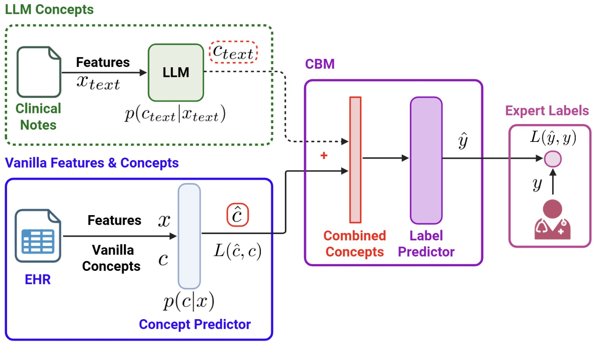

# Context-Aware Concept Bottleneck Models

> This repository contains code for the following paper: [LINK TO BE ADDED]

**Improving ARDS Diagnosis Through Context-Aware Concept Bottleneck Models**
* This is the joint work of [Anish Narain](https://github.com/anish-narain), [Ritam Majumdar](https://github.com/Ritam-M), [Nikita Narayanan](https://github.com/NikitaN65), [Dominic Marshall](https://github.com/Dom-Marshall), [Sonali Parbhoo](https://github.com/sonaliparbhoo).
* Accepted at **Machine Learning for Healthcare (MLHC) 2025**

## Abstract

  

Large, publicly available clinical datasets have emerged as a novel resource for understanding disease heterogeneity and to explore personalization of therapy. These datasets are derived from data not originally collected for research purposes and, as a result, are often incomplete and lack critical labels. Many AI tools have been developed to retrospectively label these datasets, such as by performing disease classification; however, they often suffer from limited interpretability. Previous work has attempted to explain predictions using Concept Bottleneck Models (CBMs), which learn interpretable concepts that map to higher-level clinical ideas, facilitating human evaluation. However, these models often experience performance limitations when the concepts fail to adequately explain or characterize the task. We use the identification of Acute Respiratory Distress Syndrome (ARDS) as a challenging test case to demonstrate the value of incorporating contextual information from clinical notes to improve CBM performance. Our approach leverages a Large Language Model (LLM) to process clinical notes and generate additional concepts, resulting in a 10% performance gain over existing methods. Additionally, it facilitates the learning of more comprehensive concepts, thereby reducing the risk of information leakage and reliance on spurious shortcuts, thus improving the characterization of ARDS.

## Usage
| Folder | Description |
| ---- | ---- |
| `mimic-data-processing` | We used the [MIMIC-IV v2.2](https://physionet.org/content/mimiciv/2.2/) database. Due to access restrictions under the PhysioNet Credentialed Health Data Use Agreement, the datasets used for the CBM and LLM code cannot be shared. However, the scripts used to generate them are available in this folder. We accessed MIMIC-IV on [Google BigQuery](https://mimic.mit.edu/docs/gettingstarted/cloud/bigquery/) for dataset creation. The original patient cohort (referred to as `ards_cohort`) was selected by a physician using criteria detailed in Section 3 of the paper.|
| `llm-code` | The LLM code is executed on a combination of discharge summaries, radiology reports, and echocardiography interpretations associated with each patient, all sourced from [MIMIC-IV Note](https://physionet.org/content/mimic-iv-note/2.2/). It is implemented as a Python notebook and includes 8 separate files, one for each of the 8 LLM concept labels. The notebook was run on Google Colab and requires a GPU. |
| `cbm-code` | The CBM code (`context-aware-cbm.ipynb`) runs on a combination of EHR data from MIMIC-IV and eight LLM-derived concepts. It is implemented in a Python notebook, which includes both Vanilla CBM and Context-Aware CBM implementations. The notebook also presents evaluation metrics, intervention case studies, and other experimental results. An additional notebook is included, containing the experiments conducted in response to reviewer comments (`experiments-for-rebuttals.ipynb`).|
